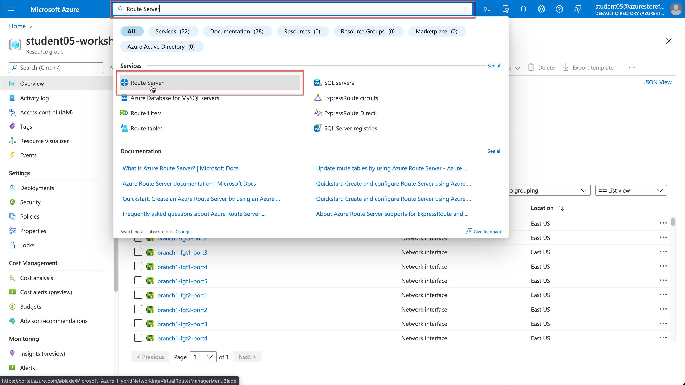
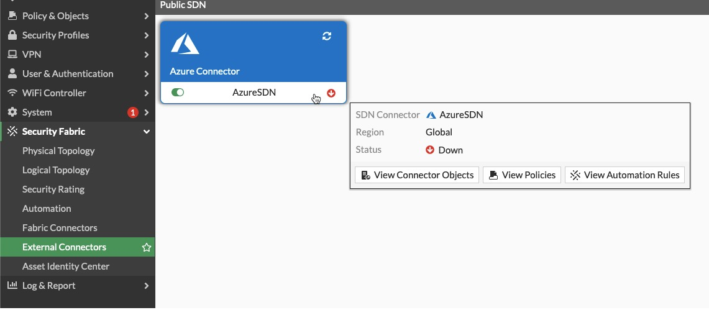
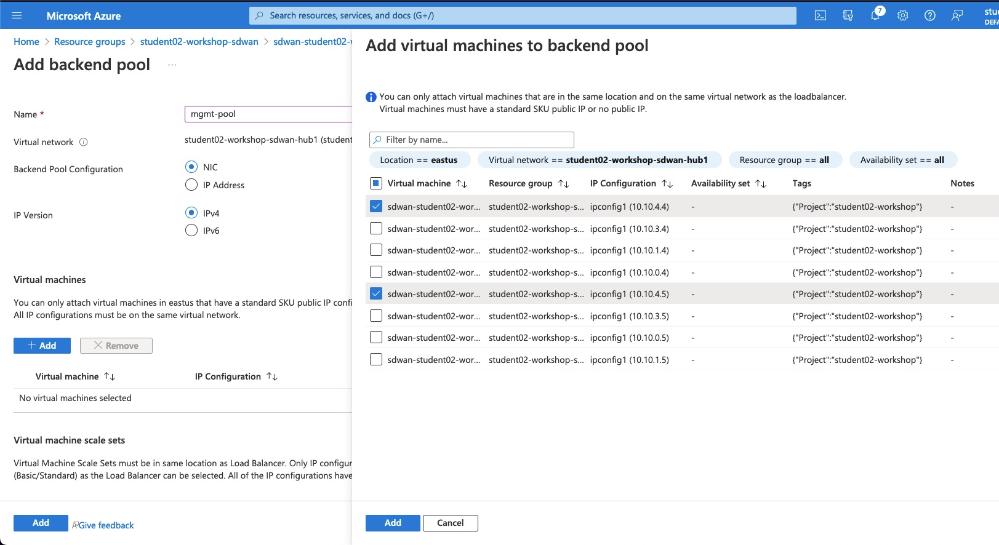
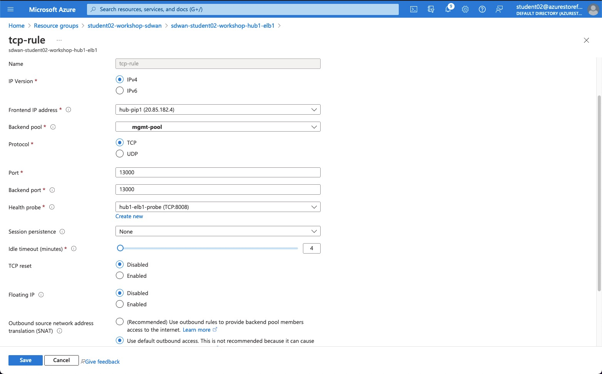
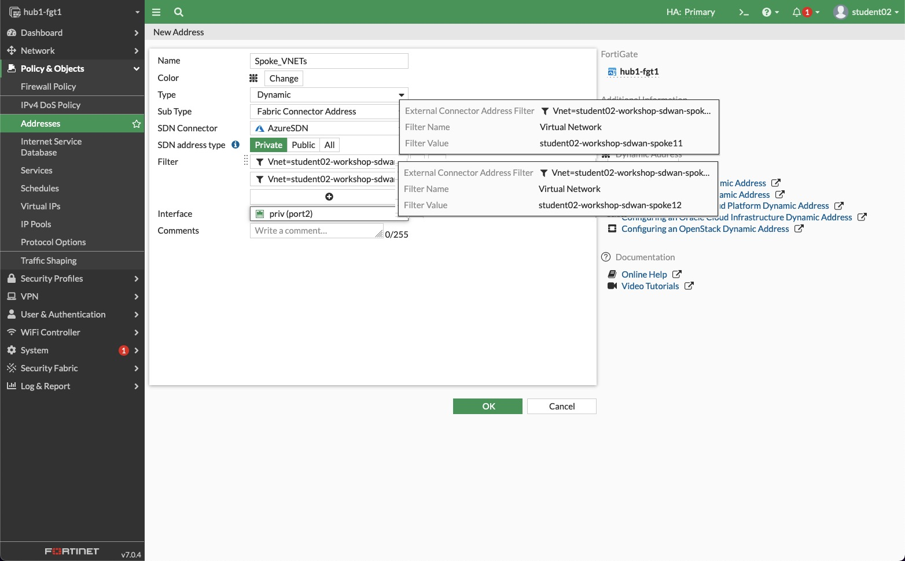
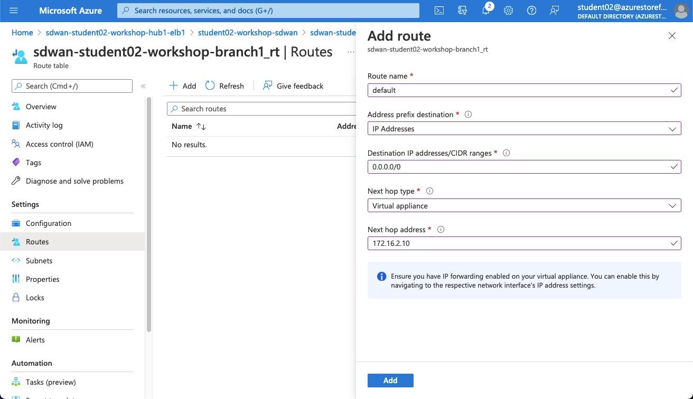
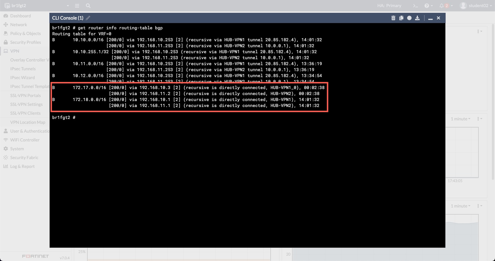

# Azure SDWAN Workshop

## Workshop Main Objectives

* Deploy the SDWAN architecture using Terraform
* Configure Azure components
  * Load Balancer
  * VNET Peering
  * Route Server
  * vWAN and vWAN Hub
* Understand the different available architecture options

***
***

## Chapter 1 - Setting up the environment (40min)

***[Deployment exercise - estimated duration 40min]***

<details>

### Task 1 - Setup your AzureCloud Shell

* Login to Azure Cloud Portal [https://portal.azure.com/](https://portal.azure.com/) with the provided login/password

    
    

* Click on Cloud Shell icon on the Top Right side of the portal

    

* Select **Bash**

    

* Click on **Show advanced settings**

    
* Select
  * Use existing Resource Group  - it ***should*** auto populate with USERXX-workshop-sdwan (USERXX is your Username)
  * Use existing Storage account - it ***should*** auto populate with trainUSERXX######## (######## is a random string)
  * Use existing File Share  - type **cloudshell**
* Click "Attach Storage"

    

* You should now have access to Azure Cloud Shell console

    

### Task 2 - Run the Terraform Code

Perform the following step in your Cloudshell console to create your environment.

1. Clone the Github repo
1. Change to the se-summit folder
1. Initialize Terraform
1. Create Terraform Plan
1. Apply Terraform Plan

> **Copy and paste these commands into your Cloudshell console.**
> The terraform variable `username` will be populated with the value of the environment variable `USER` 

```sh
git clone https://github.com/FortinetSecDevOps/se-conf-sdwan-workshop.git
cd ./se-conf-sdwan-workshop/se-summit/
terraform init
terraform plan -var="username=${USER}"
terraform apply -var="username=${USER}"
```

  

* At the end of this step you should have the following architecture

    

### Task 3 - Terraform Verifications

* Using the Terraform output, verify that you have Web and SSH access to the FortiGates.

    

* Terraform output can be redisplayed at any point as long as you are in the `./se-conf-sdwan-workshop/se-summit/` directory, by using the command
  * `terraform output`

* Connect to the Branch sites FortiGates and check the VPN status. If they are down try to bring them UP.

### Chapter 1 - QUIZ

1. FortiGates in the Hub do not have public IPs, how are they accessible via the Web UI?

1. Why the VPN connections are still down?

  <details>

  <summary>Quiz 1 Answers</summary>

1. **FortiGates in the Hub do not have public IPs, how are they accessible via the Web UI?**

    * The Public IPs on the external load balancers for the Hub, Branch1 and Branch2 FortiGates have inbound NAT rules setup.

1. **Why the VPN connections are still down?**

    * The external load balancer for the Hub FortiGates needs load balancing rules for UDP 500 and UDP 4500.

  </details>
  
</details>

***
***

## Chapter 2 - Hub and Branch VPN Connectivity (20min)

***[Configuration exercise - estimated duration 20min]***

<details>

### Task 1 - Add the FortiGates to the Hub Load Balancer Backend Pool

* Go to the Hub External Load Balancer **sdwan-USERXX-workshop-hub1-elb1**
* Click on Backend pools
* Add FortiGate1 and FortiGate2 **port1 interfaces** and then click on Save

    

### Task 2 - Create load balancing rules for IPSEC VPN Traffic

* Click on the Hub External Load balancer **sdwan-USERqXX-workshop-hub1-elb1**
* Click on Load balancing rules
* Create Load balancing rules for UDP 500 and UDP 4500 - ***one rule for each***

    
    

### Task 3 - Hub and Branch VPN Connectivity Verifications

* Verify that the FortiGates are responding to Azure Load Balancer Health Checks
  * Click on the Hub External Load balancer
  * Click on Insights - Click the "Refresh" button a few times, eventually (~30 seconds) the FortiGate reachability will be indicated.

    

* Verify that the VPN to the Hub are UP  (You may have to reboot the Branch FortiGate one time if the VPN does not come up)

    

* Verify that the BGP peering with the hub is UP and that the Branch FortiGate learned the Hub and other Branches' CIDRs `get router info routing-table all`

* At the end of this step you should have the following architecture

    

### Chapter 2 - QUIZ

1. Why is one FortiGate depicted as unhealthy by the Azure Hub External Load Balancer?

1. Why is NAT used to access the FortiGates, but for IPSEC VPN traffic Load balancing rules are used?

1. Do FortiGates in the Branches learn Spoke11 and Spoke12 CIDRs?

  <details>

  <summary>Quiz 2 Answers</summary>

1. **Why is one FortiGate depicted as unhealthy by the Azure Hub External Load Balancer?**

    * The passive FortiGate does not respond to the load balancer health probes. Only after a failover event will the newly active FortiGate start responding to health probes.

1. **Why is NAT used to access the FortiGates, but for IPSEC VPN traffic Load balancing rules are used?**

    * NAT allows each individual FortiGate to be accessed via the Public IP of the load balancer. A load balancer rule would only allow access to the Active FortiGate.

1. **Do FortiGates in the Branches learn Spoke11 and Spoke12 CIDRs?**

    * Spoke11 and Spoke12 CIDRs are not yet know to the FortiGate so the Branches will not learn them yet.

  </details>

</details>

## Chapter3 - Azure Route Server Presentation (30min)

***[Presentation about Azure Route Server- estimated duration 30min]***

***
***

## Chapter 4 - Hub VNET and Spoke VNET Connectivity (40min)

***[Configuration and troubleshooting exercise - estimated duration 40min]***

<details>

### Task 1 - Create the VNET peering

* Create a VNET peering between the Spoke11 VNET and the Hub VNET

  * Go to the Spoke VNET, **USERXX-workshop-sdwan-spoke11** - (replace USERXX with your username)
    * Click on Peerings
    * Add peering to Hub VNET, **USERXX-workshop-sdwan-hub1**

  * Repeat the above between Spoke12 VNET, **USERXX-workshop-sdwan-spoke12** and the Hub VNET

    

* Verify that the Branch FortiGates have learned the Spoke11 VNET and Spoke12 VNET CIDRs

### Task 2 - Check Azure Route Server Configuration and Learned Routes

* Go to Azure Route Server
  * **USERXX-workshop-sdwan-RouteServer** contained within your Resource Group.

    

* Click on Peers on the left side of the menu, verify the connection to the Hub FortiGates
* List the routes learned by Azure Route Server, run the commands below from your Azure Cloud Shell
* The variable `${USER}` in the commands reads your username from the environment

```bash
az network routeserver peering list-learned-routes -g ${USER}-workshop-sdwan --routeserver ${USER}-workshop-sdwan-RouteServer --name sdwan-fgt1
az network routeserver peering list-learned-routes -g ${USER}-workshop-sdwan --routeserver ${USER}-workshop-sdwan-RouteServer --name sdwan-fgt2
```

> The passive FortiGate will produce empty output

```json
{
  "RouteServiceRole_IN_0": [],
  "RouteServiceRole_IN_1": [],
  "value": null
}
```

### Task 3 - Create a Dynamic SDN object [troubleshooting required]

* Is your Hub FortiGate able to see the Dynamic filters ?
  * **Troubleshoot and Make the required changes to allow the FortiGate to retrieve the SDN filters.**

    * Hub FortiGate debug the Azure SDN Connector

      ```bash
      diagnose debug application azd -1
      diagnose debug enable
      ```

  * Hints:

    ***

    * FGT Branch3 is able to retrieve the filters, why that is not the case for the FortiGates behind Load Balancers?
    * FGT Branch3 is standalone, all other FortiGates are in A-P HA, how does that affect traffic to retrieve SDN filters?
    * Hub External Load Balancer needs a management nic backend pool and a TCP rule any port suffices. This rule is about letting TCP traffic out. The External Load Balancer will let the response traffic back in because the traffic originated internally.

    

    

    

    

* On the Hub FortiGate, create a dynamic address object named `Spoke_VNETs` that resolves to the Spoke VNETs VMs

    

* On the Hub FortiGate, use the object created above on the `Branch to Cloud` policy to restrict traffic coming from the Branches

    

### Task 4 - Traffic generation

* Generate Traffic from Branch1 Primary FortiGate:  
  1. Connect to the Branch1 Primary FortiGate
  2. Configure ping-options to initiate traffic from FortiGate's private nic (port2).
      * `execute ping-options source 172.16.2.5` - source IP depends on which Branch1 FortiGate is primary br1fgt1 or br1fgt2
      * `execute ping-options repeat-count 100`
  3. Initiate a ping to Spoke11 and Spoke12 Linux VMs (10.11.1.4 and 10.12.1.4)
      * `execute ping 10.11.1.4`
      * `execute ping 10.12.1.4`

    

    

* Generate Traffic from Branch1 Linux VM:  
    1. Enable serial console access on Branch1 Linux VM
        * Click on the VM **USERXX-sdwan-workshop-br1lnx1**
        * Go to Boot diagnostics -> Settings ->  Select **Enable with custom storage account**
        * From the dropdown list, select the storage account that is assigned to your username - **trainUSERXX#######**
        * Click Save

            
            

    2. Go to the VM Serial Console
        

    3. Initiate a ping to Spoke11 and Spoke12 Linux VMs

        ```bash
        ping 10.11.1.4
        ping 10.12.1.4 
        ```

        

    4. Does it work?

* At the end of this step  you should have the following architecture

    

### Chapter 4 - QUIZ

1. What was missing to allow the FortiGates to retrieve SDN connector filters?

1. Why is the FortiGate only able to retrieve the SDN connector filters in its own Resource Group?

1. Why is the Branch FortiGate able to reach the remote Spoke VNETs VMs (10.11.1.4 and 10.12.1.4) but the Linux VM behind the Branch1 FortiGate cannot?

1. FortiGates at Branch1 and Branch2 site are both behind Azure Load Balancers (behind NAT). Will Branch1 to Branch2 traffic successfully establish an ADVPN shortcut?

  <details>

  <summary>Quiz 4 Answers</summary>

1. **What was missing to allow the FortiGates to retrieve SDN connector filters?**

    * The FortiGate's management interfaces need access to the Azure APIs via a public IP address. This required adding a backend pool for the FortiGate management interfaces and a TCP load balancing rule to let the API response to an internal request back through the external load balancer.

1. **Why is the FortiGate only able to retrieve the SDN connector filters in its own Resource Group?**

    * The FortiGate VM Azure Identity was given the "Reader" role with the scope of the Resource Group.

1. **Why is the Branch FortiGate able to reach the remote Spoke VNETs VMs (10.11.1.4 and 10.12.1.4) but the Linux VM behind the Branch1 FortiGate cannot?**

    * The Linux VM does not know how to get to the FortiGate because no default route was defined for the route table which controls the subnet the Linux VM is in.

1. **FortiGates at Branch1 and Branch2 site are both behind Azure Load Balancers (behind NAT). Will Branch1 to Branch2 traffic successfully establish an ADVPN shortcut?**

    * Yes

  </details>

</details>

***
***

## Chapter5 - Branch to Cloud and Branch to Branch Connectivity (20min)

***[Configuration exercise - estimated duration 20min]***

<details>

### Branch to Cloud

#### Task 1 - Create a route in the UDR

* Click on the Branch1 private route table **USERXX-sdwan-workshop-branch1_rt**
* Add a default route for `0.0.0.0/0` that points to the Branch1 **Internal Load balancer listener IP**
* Repeat the previous step for the **Branch2** and **Branch3** Route Tables
  * Be sure to use the correct IP as the next hop, that is the correct Internal Load balancer listener IP or FortiGate internal interface. Hint: is the next hop a load balancer or a stand-alone FortiGate

    

    

#### Task 2 - Generate traffic to the Hub

* Connect to the Branch1 Linux Host via the serial console
* Generate traffic to Hub

    ```bash
     ping 10.11.1.4
     ping 10.12.1.4 
    ```

* Does it work now ?

#### Task 3 - Check effective routes

* Go to your resource group and click on Spoke11 Linux VM
* Click on Networking in the Navigation Menu

    

* Click on the VM nic
    

* Click on **Effective routes**
    

* Check that Azure Route Server has injected the Branch sites CIDRs learnt from the FGT

* Go to your resource group and click on the Hub FGT VM
* Click on Networking in the Navigation Menu

    

* Click on the VM port2 nic
    

* Click on **Effective routes**
    

* Has Azure Route Server injected the Branch sites CIDRs learnt from the FGT?  Why ?

### Branch to Branch

#### Task 4 - Generate traffic between Branches

* Connect to the Branch1 Linux Host via the serial console - **USERXX-sdwan-workshop-br1lnx1**
* Generate traffic to Branch2 Linux Host

   ```bash
     ping 172.17.5.4
    ```

* Check if an ADVPN shortcut has been created



### Chapter 5 - QUIZ

1. Why has the Azure Route Server (ARS) injected Branch site CIDRs to the Spoke VNET protected subnet but not the FortiGate private subnet?

1. The Branch external load balancer has two front end public IP. How do we ensure that traffic egressing Branch1 on port1 (isp1) always has the same public IP applied? Same for traffic egressing Branch1 on port3 (isp2)

  <details>

  <summary>Quiz 5 Answers</summary>

1. **Why has the Azure Route Server (ARS) injected Branch site CIDRs to the Spoke VNET protected subnet but not the FortiGate private subnet?**

    * Route propagation into the FortiGate private subnet is set to no.

1. **The Branch external load balancer has two front end public IP. How do we ensure that traffic egressing Branch1 on port1 (isp1) always has the same public IP applied? Same for traffic egressing Branch1 on port3 (isp2)?**

    * By using outbound rules associated to backend pools connected to those ports on each FortiGate.

  </details>

</details>

***
***

## Chapter6 - Redundancy (20min)

**[failover exercise - estimated duration 20min]***

<details>

### Task 1 - Generate ICMP traffic

* Connect to the Branch1 Linux Host via the serial console - **USERXX-sdwan-workshop-br1lnx1**
* Ping a resource in a remote branch site - **sdwan-USERXX-workshop-spoke11-subnet1-lnx**
  * `ping 10.11.1.4`
  * Let the ping run

### Task 2 - Initiate a failover

* Connect to the Branch1 Primary FortiGate . Initiate a failover by rebooting the primary FortiGate or by forcing a failover via the CLI

  ```bash
  execute ha failover set 1
  ```

* Monitor the number of **lost Pings** and the **failover time**
* How long did it take?
* Have the VPNs to the Hub been renegotiated upon failover or maintained?

### Task 3 - Generate TCP traffic

* Ensure that both Branch1 FortiGates in the cluster are up and running
* Connect to the Branch1 Linux Host via the serial console - **USERXX-sdwan-workshop-br1lnx1**
* Generate an SSH session to the Spoke Linux VM - **sdwan-USERXX-workshop-spoke11-subnet1-lnx**

   ```bash
   ssh USERXX@10.11.1.4
   ```

* From Spoke Linux VM SSH session generate a continuous stream of connections to track the failover event

   ```bash
   while true; date; do curl -I -sw '%{http_code}'  https://www.lemonde.fr/ ; echo -e "\n================="; sleep 1 ; done
   ```

* Connect to the Branch1 Primary FortiGate . Initiate a failover by rebooting the primary FortiGate or by forcing a failover via the CLI

* Monitor the SSH connection
* Did you lose the TCP connection?

### Chapter 6 - QUIZ

1. How long was your failover time?

1. Why did we lose the SSH (TCP) session with a "short" failover time?

  <details>

  <summary>Quiz 6 Answers</summary>

1. **How long was your failover time?**

    * It should have been between 15 - 25 seconds.

1. **Why did we lose the SSH (TCP) session with a "short" failover time?**

    * TCP sessions are not maintained by the Azure load balancer.

  </details>

</details>

***
***

## Chapter7 - Scaling (20min)

***[Presentation about FGT A/A and SDWAN use case- estimated duration 20min]***

***
***

## Chapter8 - Azure virtualWAN [estimated duration 60min]

***[Configuration exercise - estimated duration 20min]***

<details>

### Task 1 - Deployment

* Create your vWAN and the vWAN Hub using the CLI commands below. Use the Hub FortiGate location for the VWAN location.
  * You can find the location of your Hub FortiGates with this Azure CLI Command

  `az vm show -g ${USER}-workshop-sdwan -n sdwan-${USER}-workshop-hub1-fgt1 -o table`

* The variable `${USER}` in the commands reads your username from the environment

    ```bash
    az network vwan create --name sdwan-${USER}-workshop-vwan --resource-group  ${USER}-workshop-sdwan --location your-hub-location --type Standard
    ```

    > If you are prompted to install the extension `virtual-wan` answer `Y`

    ```bash
    az network vhub create --address-prefix 10.14.0.0/16 --name ${USER}-vwanhub --resource-group ${USER}-workshop-sdwan --vwan sdwan-${USER}-workshop-vwan --location your-hub-location --sku Standard
    ```

    

* Navigate to your Resource Group and verify that you see your vWAN

    

* Click on your vWAN and verify that you see the virtual Hub you just deployed

    

* Click on the vWAN Hub and verify that the deployment and routing status complete

    

### Task 2 - Routing and VNET connection Configuration

* Go to your resource Group and then click on the Hub VNET - **USERXX-workshop-sdwan-hub1**
* Delete the Hub to Spoke VNET peerings, delete both Spoke11 and Spoke12 peerings

    

* Create Virtual WAN Route Tables
  * Click on your virtual Hub and then click on Routing

    
    

  * Create a Route Table Called Spoke-VNETS. Keep all other settings unchanged

    

  * Repeat the same for FGT vWAN Route Table: FGT-VNET

    

* Create Virtual WAN  VNET Connections

  * Go to the vWAN, Click on Virtual Network Connection

    

    * Create a VNET connection for Spoke11, attach it to the Spoke-VNETS Route Table and propagate it to FGT-VNET Route Table - select **your resource group and VNET** - USERXX

      

    * Repeat the same for Spoke12

    * Repeat the same for FGT VNET connection, attach it to the FGT-VNET Route Table but do not propagate to other Route Tables.

      

      * Is the connection for FGT VNET created?
      * Why not?

    * Locate your own Azure Route Server and delete it

      

    * Try now to connect the FGT VNET to the vWAN Hub, attach it to the FGT-VNET Route Table.
      * Is the connection for FGT VNET created, this try?
      * Why did it work?

        
        

* Configure Spoke-VNETS Route Table

  * Go your vWAN Hub, click on Routing and then click on Spoke-VNETS Route Table

      
      

    * Add a default route that points to the FortiGate VNET connection. The next hop ip is the **Primary FGT port2 ip**
      

    * Verify that this default route has been propagated to the Spokes VNETs
      * Go to the Spoke11 Linux VM -> Networking -> Click on nic and then click on **Effective Routes**

      
      

* At the end of this step you should have the following architecture

      

### Task 3 - Traffic generation [troubleshooting required]

* Connect to the Branch1 Linux Host via the serial console
* Generate traffic to Hub

    ```bash
     ping 10.11.1.4
    ```

* Does it work ?

      

* Troubleshoot and make all the required changes to make it work

  * Hints:

    ***

    * FGT Branch1 does it learn routes to spokes from the Hub?
    * Configure the Hub FGT to advertise Spoke11 and Spoke12 CIDRs to the Branches
      * On the Hub FGT, add Static Routes to Spoke11 and Spoke12. **What would be the next-hop ?**
      * Add Spoke11 and Spoke12 to the list of networks under BGP configuration

        ```bash
        config router bgp
          config network
              edit 1
                  set prefix 10.10.255.1 255.255.255.255
              next
              edit 2
                  set prefix 10.11.0.0 255.255.0.0
              next
              edit 3
                  set prefix 10.12.0.0 255.255.0.0
              next
          end
        end
        ```

      * Verify that Branches are now receiving Spoke11 and Spoke12 CIDRs. Use the command
        `get router info routing-table all`

      * Does it work now or not yet ?
      * Take a packet capture on the Hub, Do you see echo-requests arriving?  
        `diagnose sniffer packet any 'net 10.11.0.0/16' 4 0 a`

      * Traffic is egressing the Hub FGT on port2, but you don't see any reply?... What is missing?  
        * Check FGT Hub port2 **effective routes**?
        * Do you see spoke11 and spoke12 CIDRs? Why the vWAN is not propagating them to the Route Table attached to the FGT private subnet, **sdwan-USERXX-workshop-hub1_fgt-priv_rt**?  
        * Check the Route Table **configuration** settings

        

### Chapter 8 - QUIZ

1. Why were we not able to attach the Hub FortiGate VNET to vWAN until we deleted Azure Route Server?

1. Why was the vWAN not able to inject Spoke11 and Spoke12 VNETs CIDRs to FortiGate Private UDR?

1. The above setting is normally set to "yes", why did we set it to "no" ? Hint: We had Azure Route Server before

1. In the Spoke-VNETS vWAN Route Table, the next-hop is the Primary FortiGate IP. What should we add/do to handle failover?

  <details>

  <summary>Quiz 8 Answers</summary>

1. **Why were we not able to attach the Hub FortiGate VNET to vWAN until we deleted Azure Route Server?**

    * An Azure VNET cannot receive routes from more than the vWAN and the RouteServer at the same time.

1. **Why was the vWAN not able to inject Spoke11 and Spoke12 VNETs CIDRs to FortiGate Private UDR?**

    * Route propagation for the FortiGate route table sdwan-USERXX-workshop-hub1_fgt-priv_rt was set to no.

1. **The above setting is normally set to "yes", why did we set it to "no"?**

    * Azure RouteServer provided the routes

1. **In the Spoke-VNETS vWAN Route Table, the next-hop is the Primary FortiGate IP. What should we add/do to handle failover?**

    * An internal load balancer could be added and use that IP as the next hop or an automation stich could be run at failover to update the Spoke-VNETS vWAN Route Table to point to the newly active FortiGate private interface.

  </details>

</details>
