# Azure SDWAN Workshop

## Workshop Main Objectives

* Deploy the SDWAN architecture using Terraform
* Configure Azure components
  * Load Balancer
  * VNET Peering
  * Route Server
  * vWAN and vWAN Hub
* Understand the different available architecture options

***
***

## Chapter1 - Setting up the environment (40min)

***[Deployment exercise - estimated duration 40min]***

<details>

### Task 1 - Setup your AzureCloud Shell

* Login to Azure Cloud Portal [https://portal.azure.com/](https://portal.azure.com/) with the provided login/password

    
    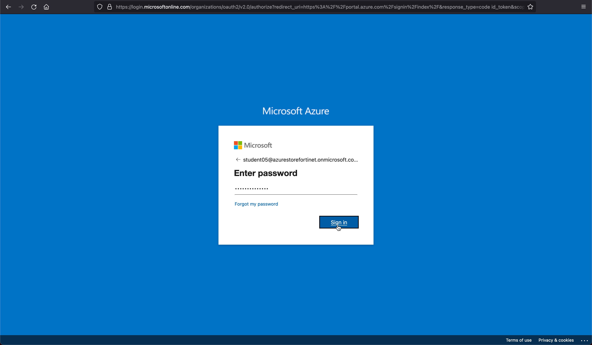

* Click on Cloud Shell icon on the Top Right side of the portal
* Select Bash

    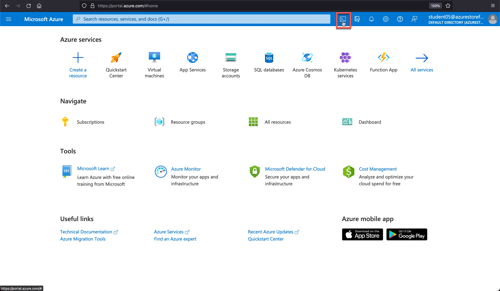
    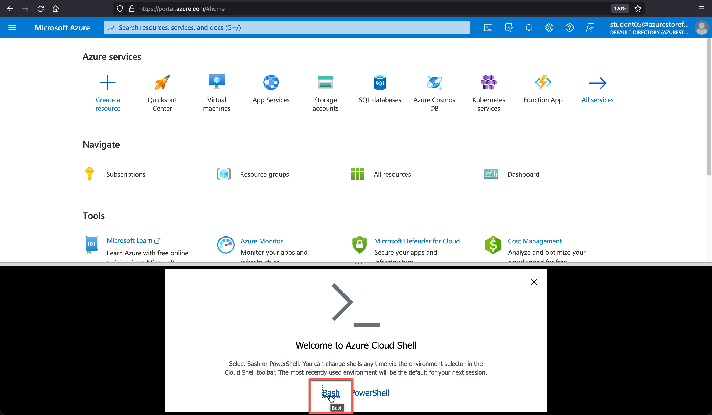

* Click on **show advanced settings**

    

* Select **your own resource group** , use the the storage account available in that Resource Group, use the existing File Share **cloudshell**  (type cloudshell)

    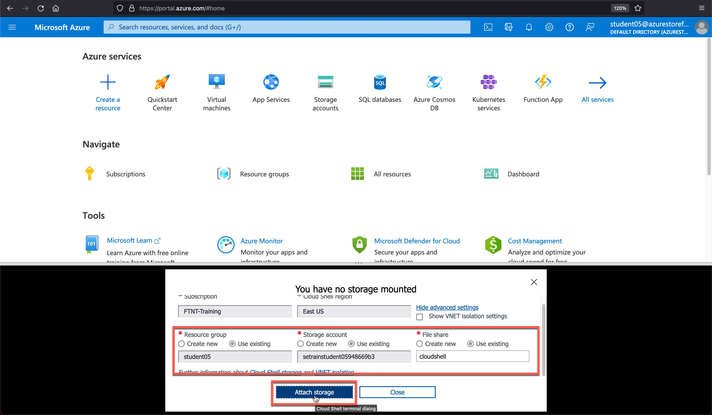

* You should now have access to Azure Cloud Shell console

    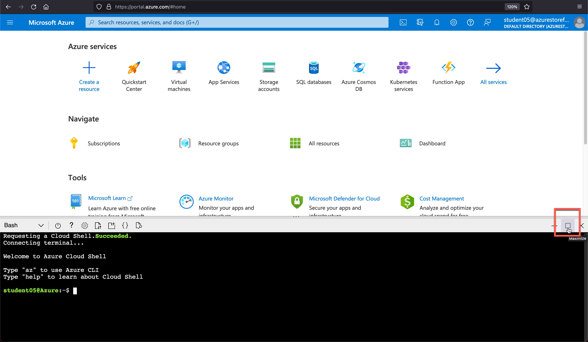

### Task 2 - Run the Terraform Code

* Clone the Github repo `git clone https://github.com/FortinetSecDevOps/se-conf-sdwan-workshop.git`

    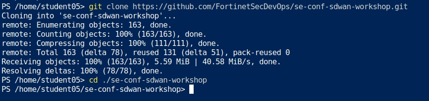

* Move to the azure folder `cd ./se-conf-sdwan-workshop/azure/`
* Customize your project name and the User name, based on the user id that was assigned to you
  
  `vi terraform.tfvars`

    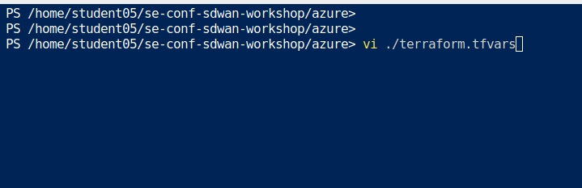
    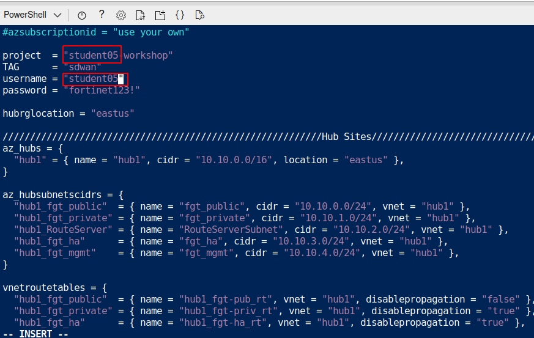

* Run `Terraform init`
* Run `Terraform plan`
* Run `Terraform apply` and then answer `yes`

* At the end of this step you should have the following architecture
    

### Task 3 - Verifications

* Using the Terraform output verify that you have Web and SSH access to the FortiGates

    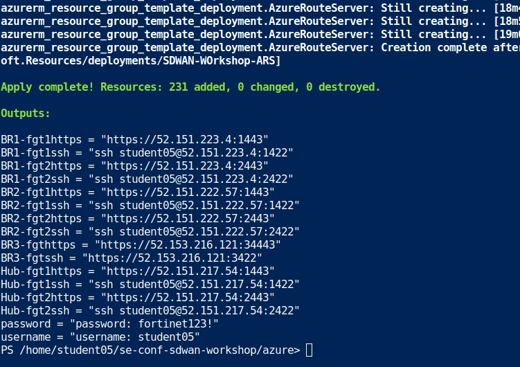

* Connect to the Branch sites FortiGates and check the VPN status. If they are down try to bring them UP


### Task 4 - QUIZ

* FortiGates in the Hub do not have public IPs attached to them, how are we able to access the Web UI then?
* Why the VPN connections are still down?

</details>

***
***

## Chapter2 - Hub and Branch VPN Connectivity (20min)

***[Configuration exercise - estimated duration 20min]***

<details>

### Task 1 - Add the FortiGates to the Hub Load Balancer Backend Pool

* Go to the Hub External Load Balancer **sdwan-student01-workshop-hub1-elb1**
* Click on Backend pools
* Add FortiGate1 and FortiGate2 **port1 interfaces** and then click on Save

    

### Task 2 - Create load balancing rules for IPSEC VPN Traffic

* Click on the Hub external Load balance and go to Load balancing rules
* Create Load balacing rules for UDP 500 and UDP 4500

    
    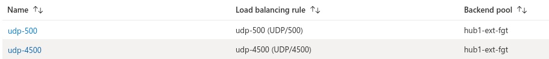

### Task 3 - Verifications

* Verify that the FortiGate are responding to Azure Load Balancer Health Checks: click on the Hub external Load balance and then go to Insights

    

* Verify that the VPN to the Hub are UP  (please reboot the Branch FortiGate once if the VPN does not come up)

    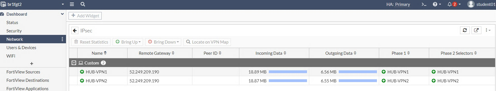

* Verify that the BGP peering with the hub is UP and that the Branch FortiGate learn the Hub and other Branches CIDRs

* At the end of this step you should have the following architecture
    

### Task 4 - Traffic generation

### Chapter 1 - QUIZ

* Why one FortiGate is depicted as unhealthy by Azure LB?
* Why to access the FortiGates we used NAT rules, and for IPSEC VPN traffic we used Load balancing rules?
* Do FortiGates in the Branches learn Spoke11 and Spoke12 CIDRs?

</details>

## Chapter3 - Azure Route Server Presentation (30min)

***[Presentation about Azure Route Server- estimated duration 30min]***

<details>

</details>

***
***

## Chapter4 - Hub VNET and Spoke VNET Connectivity (40min)

***[Configuration and troubleshooting exercise - estimated duration 40min]***

<details>

### Task 1 - Create the VNET peering

* Create a VNET peering between the Spoke11 VNET and the Hub VNET. Go to the Spoke VNET, studentxx-workshop-sdwan-spoke11 and then click on Peerings. (Please replace StudentXX with your own Student ID)
* Repeat the above between Spoke12 VNET and the Hub VNET

    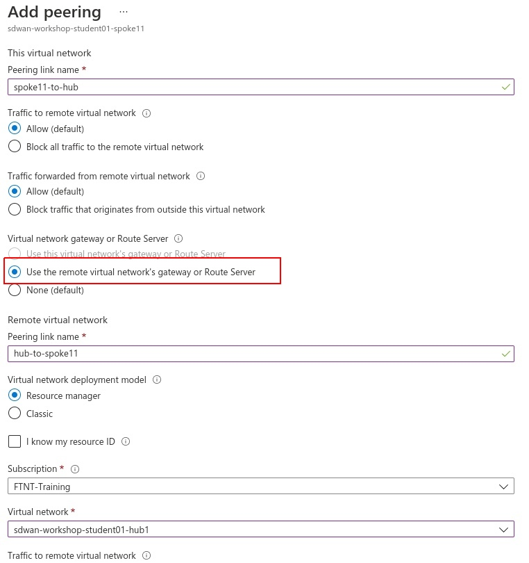

* Check now that the Branch FortiGate learn the Spoke11 VNET and Spoke12 VNET CIDRs

### Task 2 - Check Azure route server configuration and learned routes

* Go to Azure Route Server. Click on your Azure Route Server studentxx-workshop-sdwan-RouteServer. (Please replace StudentXX with your own Student ID)
* Click on Peers on the left side of the menu
* List the routes learned by Azure Route Server. Run the command below from your Azure Cloud Shell

```bash
student='student01'

az network routeserver peering list-learned-routes -g $student-workshop-sdwan --routeserver $student-workshop-sdwan-RouteServer --name sdwan-fgt1

az network routeserver peering list-learned-routes -g $student-workshop-sdwan --routeserver $student-workshop-sdwan-RouteServer --name sdwan-fgt2

```

### Task 3 - Create a Dynamic SDN object [troubleshooting required]

* Is your Hub FortiGate able to see the Dynamic filters ?
  * **Troubleshoot and Make the required changes to allow the FortiGate to retrieve the SDN filters.**
  * Hints:
        =
    * FGT Branch3 is able to retrieve the filters, why that is not the case for the FortiGates Behind Load Balancers?
    * FGT Branch3 is standalone, all other FortiGates are in A-P HA, how does that affect traffic to retrieve SDN filters?

* On the Hub FortiGate, create a dynamic object that resolves to the Spoke VNETs VMs
* On the Hub FortiGate, use the object created above on policy3 to restrict traffic coming from the Branches

    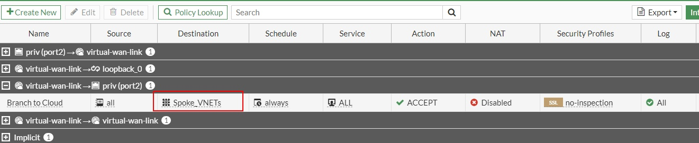

### Task 4 - Traffic generation

* Generate Traffic from Branch1 Primary FortiGate:  
    1. Connect to the Branch1 Primary FortiGate
    2. Configure ping-options to initiate traffic from FortiGate's private nic. 
    3. Initiate a ping to Spoke11 and Spoke12 Linux VM (10.11.1.4 and 10.12.1.4)

    

    

* Generate Traffic from Branch1 Linux VM:  
    1. Enable serial console access on Branch1 Linux VM
        * Click on the VM studentXX-sdwan-workshop-br1lnx1
        * Go to Boot diagnostics -> Settings ->  Select **Enable with custom storage account**
        * From the dropdown list, select the storage account that is assigned to you

            
            

    2. Go to the VM Serial Console
        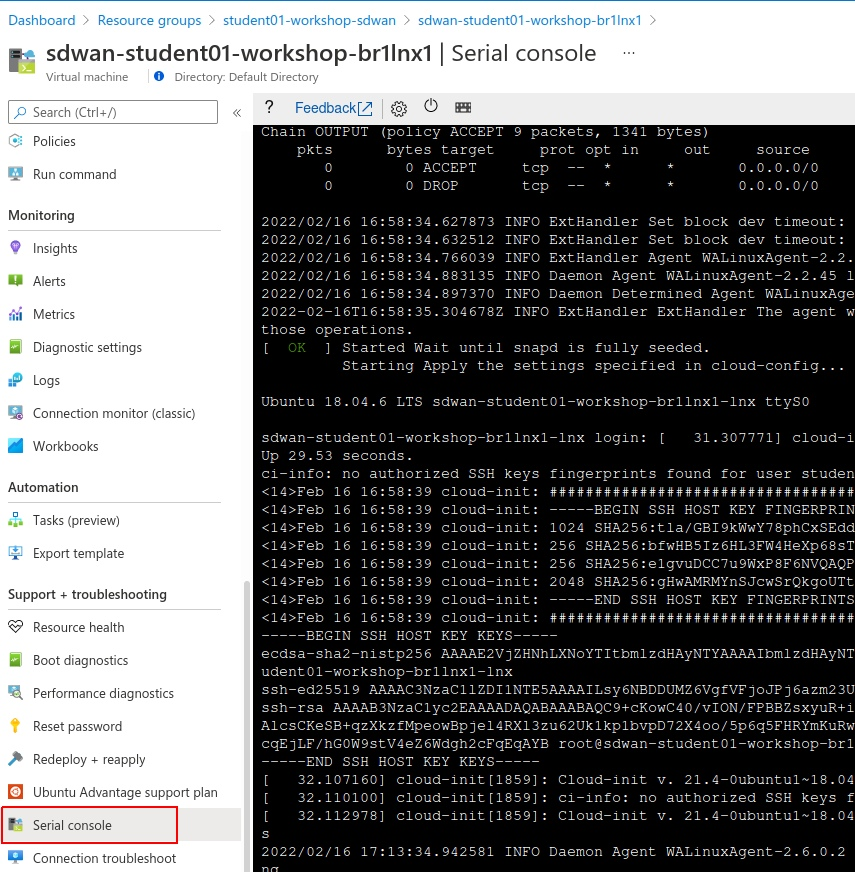

    3. Initiate a ping to Spoke11 and Spoke12 Linux VMs

    ```bash
     ping 10.11.1.4
     ping 10.12.1.4 
    ```

    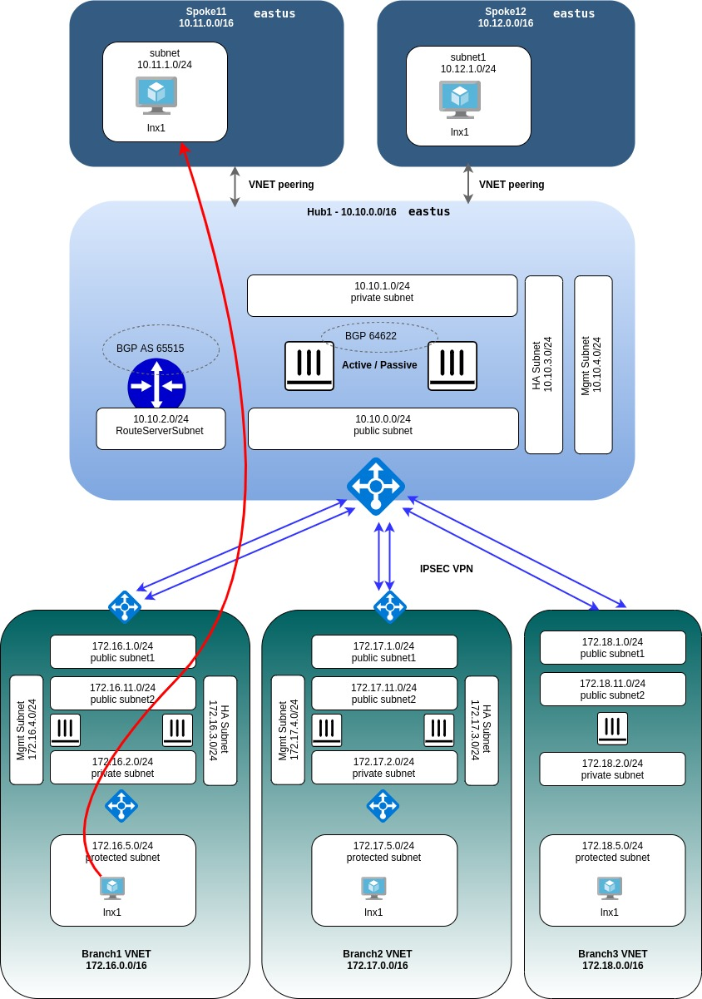

    4. Does it work ?

* At the end of this step  you should have the following architecture

    

### Task 5 - QUIZ

* What was missing to allow the FortiGates to retrieve SDN connector filters
* Why the FortiGate is able to retrieve the SDN connector filters of its own resource group Only?
* Why the Branch FortiGate itself able to reach the remote spoke VNET VM (10.11.1.4 and 10.12.1.4) but the Linux VM behind the Branch FortiGate is not ?
* FortiGate at the Branch1 and Branch2 are both behind Azure Load Balancer (behind NAT). Branch1 to Branch2 traffic will successfully establish an ADVPN shortcut?

</details>

***
***
## Chapter5 - Branch to Cloud and Branch to Branch connectivity (20min)

***[Configuration exercise - estimated duration 20min]***

<details>

### Branch to Cloud

#### Task 1 - Create a route in the UDR

* Click on the Branch1 private route table (studentxx-sdwan-workshop-branch1_rt)
* Add a default route that points to the **Internal Load balancer listener**
* **Repeat the previous step to Branch2 and Branch3 Route Tables (please use the correct ip as the next hop ie the correct Internal Load balancer listener ip)**

    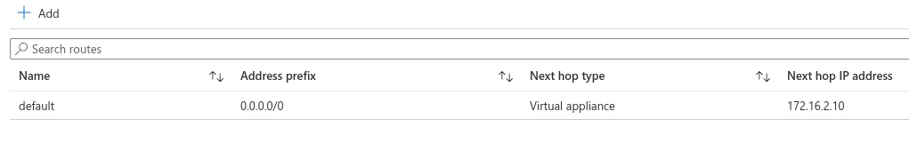

#### Task 2 - Generate traffic to the Hub

* Connect to the Branch1 Linux Host via the serial console
* Generate traffic to Hub

    ```bash
     ping 10.11.1.4
     ping 10.12.1.4 
    ```

* Does it work now ?

#### Task 3 - Check effective routes

* Go to your resource group and click on Spoke11 Linux VM
* Click on Networking in the Navigation Menu

    

* Click on the VM nic
    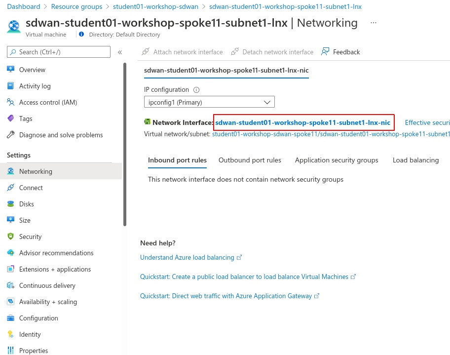

* Click on **Effective routes**
    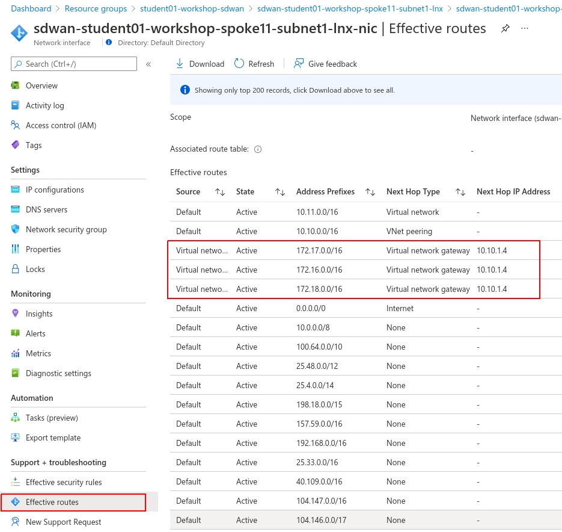

* Check that Azure Route Server has injected the Branch sites CIDRs learnt from the FGT

* Go to your resource group and click on the Hub FGT VM
* Click on Networking in the Navigation Menu

    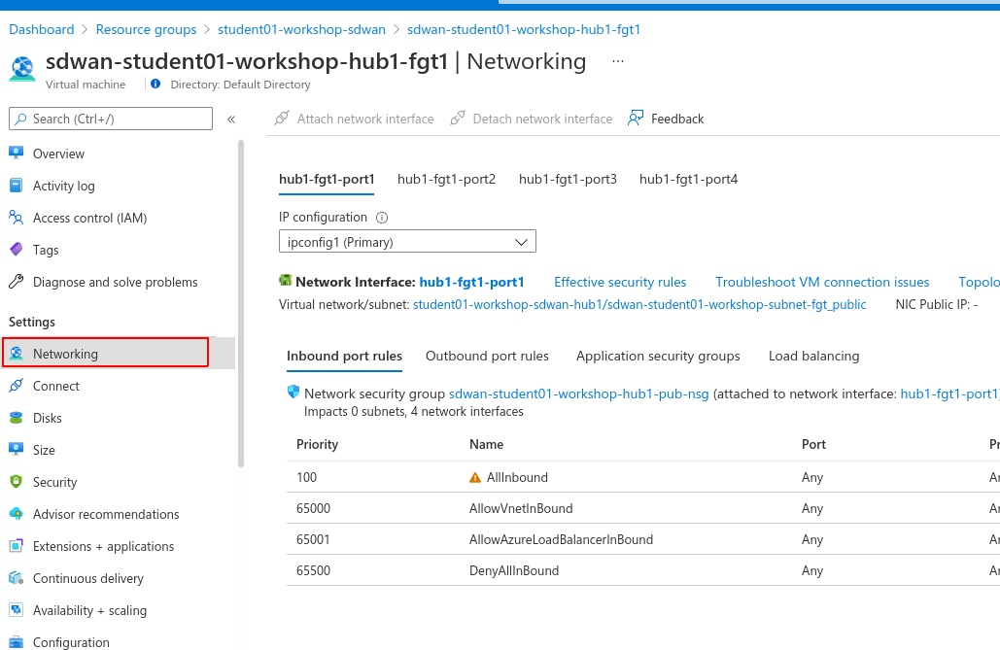

* Click on the VM port2 nic
    

* Click on **Effective routes**
    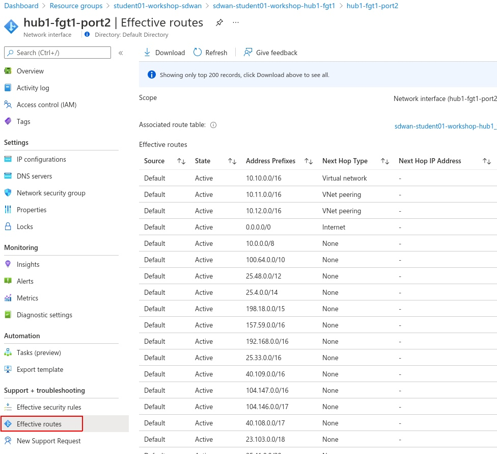

* Has Azure Route Server injected the Branch sites CIDRs learnt from the FGT?  Why ?

### Branch to Branch

#### Task 4 - Generate traffic between Branches

* Connect to the Branch1 Linux Host via the serial console
* Generate traffic to Branch2 Linux Host

   ```bash
     ping 172.17.5.4
    ```

* Check if an ADVPN shortcut has been created

### Task 5 - QUIZ

* Why Azure Route Server (ARS) has injected the Branch sites CIDRs to the Spoke VNET protected subnet but not the FortiGate private subnet?
* The Branch external Load balancer has two front end public ip. How do we ensure that traffic egressing Branch1 on port1 (isp1)  has always the same public ip applied? Same for traffic egressing Branch1 on port3 (isp2)

</details>

***
***

## Chapter6 - Redundancy (20min)

**[failover exercise - estimated duration 20min]***

<details>

### Task 1 - Generate ICMP traffic

* Access the serial console by clicking on the VM studentXX-sdwan-workshop-br1lnx1 and then Serial Console
* Ping a resource in the Hub as well as in a remote branch site `ping 10.11.1.4`

### Task 2 - Initiate a failover

* Connect to the Branch1 Primary FortiGate . Initiate a failover by rebooting the primary FortiGate
* Monitor the number of **lost Pings** and the **failover time**
* How long did it take ?
* Have the VPNs to the Hub been renegotiated upon failover or maintained ?

    

### Task 3 - Generate TCP traffic

* Ensure that both units of Branch1 FGT in the cluster is up and running
* Access the serial console of Branch1 Linux VM by clicking on the VM studentXX-sdwan-workshop-br1lnx1 and then click on Serial Console
* Generate an SSH session to the Hub Linux VM

   ```bash
   ssh studentxx@10.11.1.4
   
   ```

* From Hub Linux VM SSH session generate a continuous stream of connections to track the failover event

   ```bash
   while true; date; do curl -I -sw '%{http_code}'  https://www.lemonde.fr/ ; echo -e "\n================="; sleep 1 ; done
   ```

* Connect to the Branch1 Primary FortiGate . Initiate a failover by rebooting the primary FortiGate
* Monitor the SSH connection
* Did you lose the TCP connection ?

### Task 6 - QUIZ

* How long was your failover time ?

* Why did we lose the SSH (TCP) session with a "short" failover time ?

</details>

***
***
## Chapter7 - Scaling (20min)

***[Presentation about FGT A/A and SDWAN use case- estimated duration 20min]***

<details>

</details>

***
***

## Chapter8 - Azure virtualWAN [estimated duration 60min]

***[Configuration exercise - estimated duration 20min]***

<details>

### Task 1 - Deployment

* Create your vWAN and the vWAN Hub using the CLI command below

* Please replace the student variable with your own Student ID

   ```bash
    student='student05'

    az network vwan create --name sdwan-$student-workshop-vwan --resource-group  $student-workshop-sdwan --location eastus --type Standard

    az network vhub create --address-prefix 10.14.0.0/16 --name $student-eastushub --resource-group $student-workshop-sdwan --vwan sdwan-$student-workshop-vwan --location eastus --sku Standard
   ```

    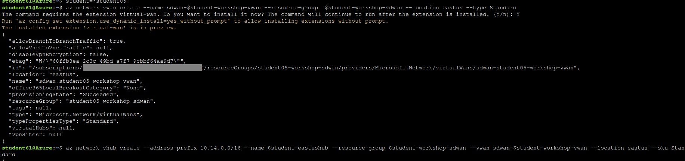

* Navigate to your Resource Group and verify that you see your vWAN

    

* Click on your vWAN and verify that you see the virtual Hub you just deployed

    

* Click on the vWAN Hub and verify that the deployment and routing status complete

    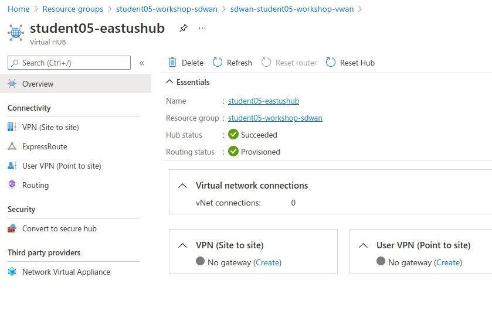


### Task 2 - Routing and VNET connection Configuration

* Go to your resource Group and then click on the Hub VNET
* Delete the Hub to Spoke VNET peerings (Please delete both Spoke11 and Spoke12 peerings)

    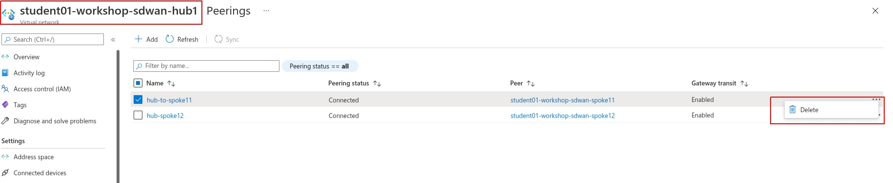

* Create Virtual WAN Route Tables
  * Click on your virtual Hub and then click on Routing

    
    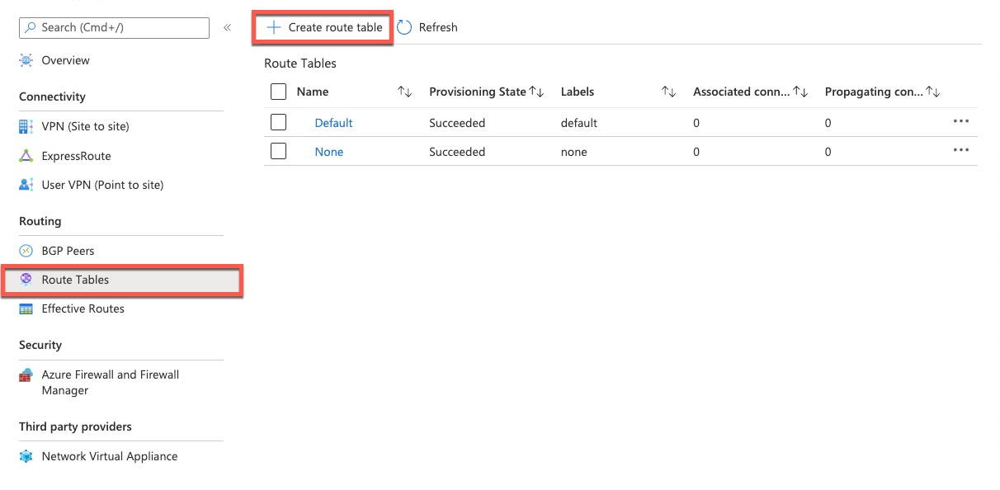

  * Create a Route Table Called Spoke-VNETS. Keep all other settings unchanged

    

  * Repeat the same for FGT vWAN Route Table: FGT-VNET

    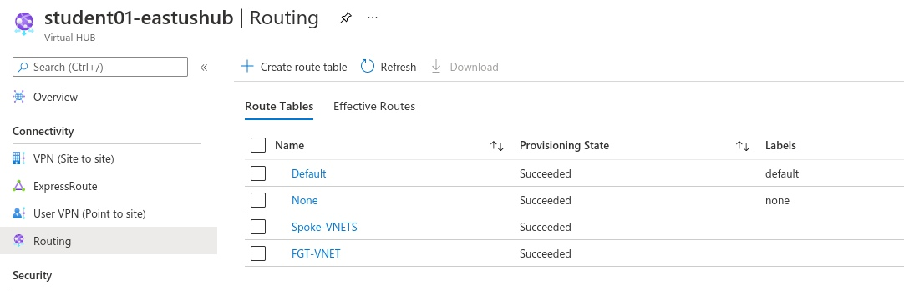

* Create Virtual WAN  VNET Connections

  * Go to the vWAN, Click on Virtual Network Connection

    

    * Create a VNET connection for Spoke11, attach it to the Spoke-VNETS Route Table and propagate it to FGT-VNET Route Table[**Please choose your own Resource Group and your own VNET** ]

      

    * Repeat the same for Spoke12

    * Repeat the same for FGT VNET connection, attach it to the FGT-VNET Route Table. 
      * Does it work?
      * why?

    * Locate your own Azure Route Server and delete it

      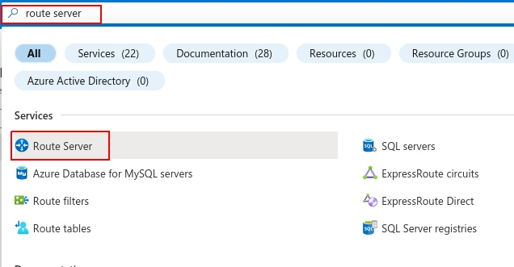
      

    * Try now to connect the FGT VNET to the vWAN Hub, attach it to the FGT-VNET Route Table.
      * Does it work now ?
      * why ?

        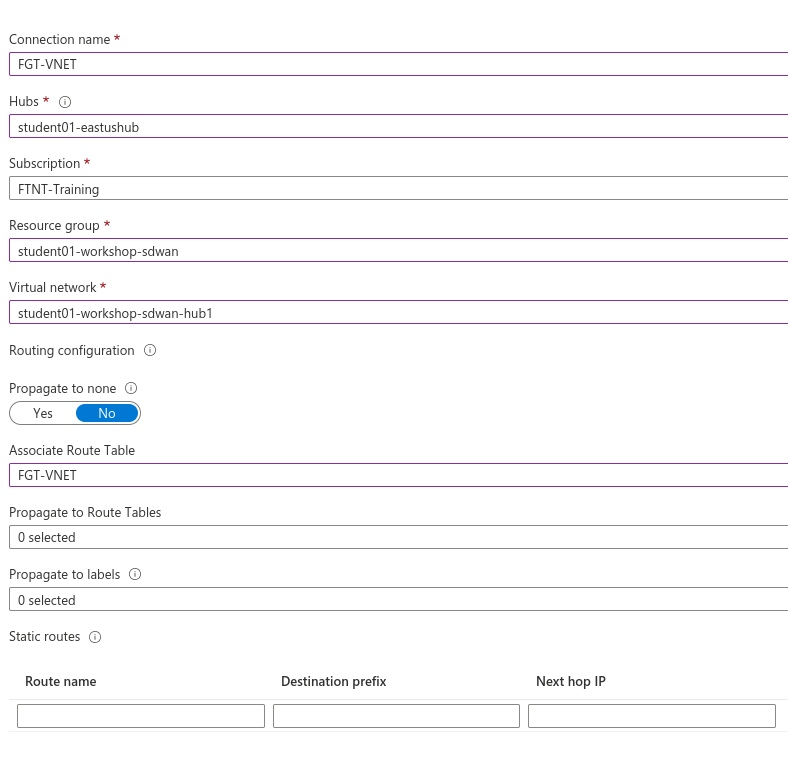
        

* Configure Spoke-VNETS Route Table

  * Go your vWAN Hub, click on Routing and then click on Spoke-VNETS Route Table

      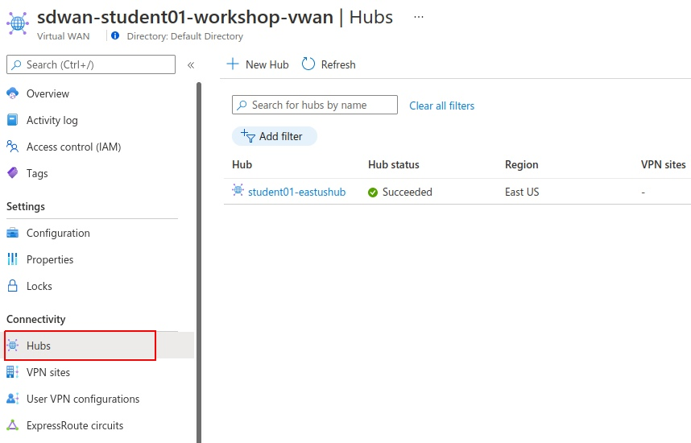
      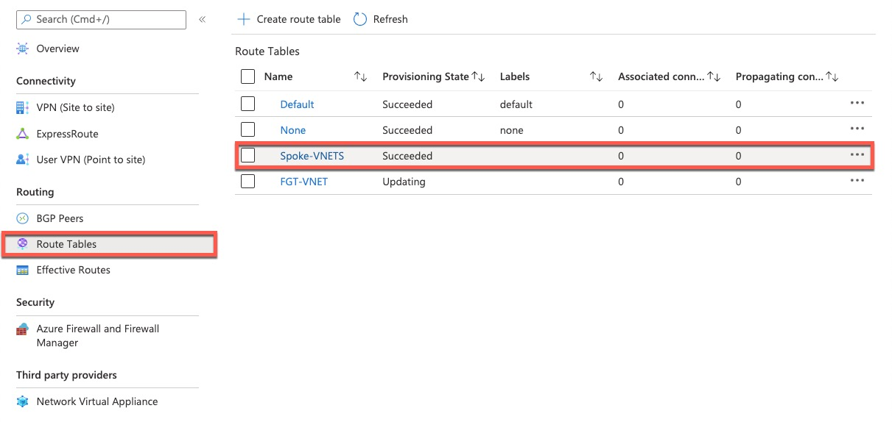

    * Add a default route that points to the FortiGate VNET connection. The next hop ip is the **Primary FGT port2 ip**
      

    * Verify that this default route has been propagated to the Spokes VNETs
      * Go to the Spoke11 Linux VM -> Networking -> Click on nic and then click on **Effective Routes**

      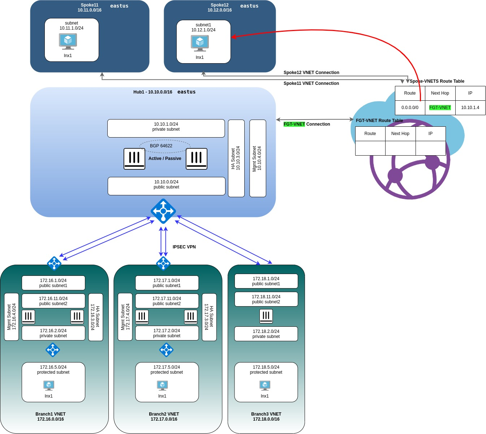
      

* At the end of this step you should have the following architecture

      

### Task 3 - Traffic generation [troubleshooting required]

* Connect to the Branch1 Linux Host via the serial console
* Generate traffic to Hub

    ```bash
     ping 10.11.1.4
    ```

* Does it work ?

      

* Troubleshoot and make all the required changs to make it work

  * Hints:
        =
    * FGT Branch1 does it learn routes to spokes from the Hub?
    * Configure the Hub FGT to advertise Spoke11 and Spoke12 CIDRs to the Branches
      * On the Hub FGT, add Static Routes to Spok11 and Spoke12. **What would be the next-hop ?**
      * Add Spoke11 and Spoke12 to the list of networks under BGP configuration

      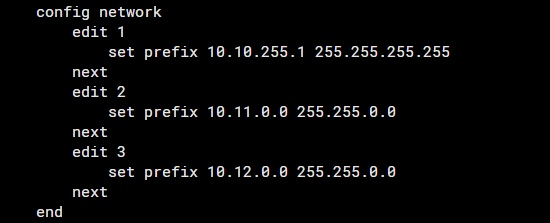 

      * Verify that Branches are now receiving Spoke11 and Spoke12 CIDRs. Use the command 
        `get router info routing-table all`

      * Does it work now or not yet ?
      * Take a packet capture on the Hub, Do you see echo-requests arriving?  
        `diagnose sniffer packet any 'net 10.11.0.0/16' 4 0 a` 

      * Traffic is egressing the Hub FGT on port2, but you don't see any reply?... What is missing?  
        * Check FGT Hub port2 **effective routes**?
        * Do you see spoke11 and spoke12 CIDRs? Why the vWAN is not propagating them to the Route Table attached to the FGT private subnet ?  
        * Check the Route Table **configuration** settings

        

### Task 4 - QUIZ

* Why we were not able to attach the Hub FortiGate VNET to vWAN until we deleted Azure Route Server ?

* Why the vWAN was not able to inject Spoke11 and Spoke12 VNETs CIDRs to FortiGate Private UDR?

* The above setting is normally set to "yes", why did we set it to "no" ? Hint: We had Azure Route Server before

* In the Spokes-VNET vWAN Route Table, the next-hop is the Primary FortiGate IP. What should we add/ do to handle failover ?

</details>
