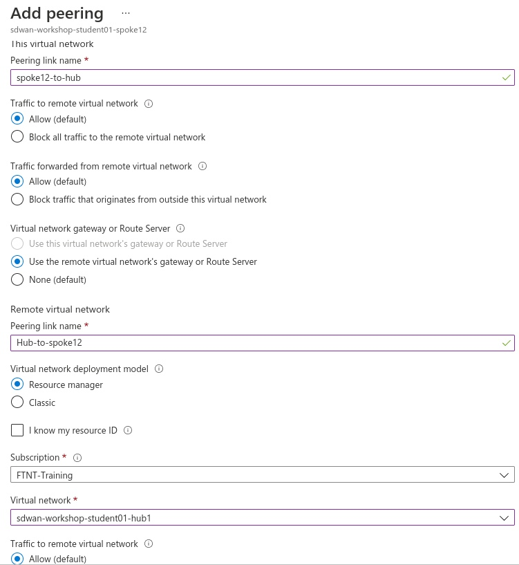

# Azure SDWAN Workshop

## Workshop main objectives
* Deploy through Terraform the SDWAN architecture
* Configure Azure components such as Azure Load Balancer, Azure VNET peering, Azure Route Server and Azure vWAN
* Understand the diffrent architecture options available


## ```diff - text in red Section 1 - Setting up the environment [Deployment exercise] [estimated duration 40min] ```
### Task 1 - Setup your AzureCloud Shell 

### Task 2 - Run the Terraform Code
* Clone the Github repo
* Run `Terraform init`
* Run `Terraform plan`
* Run `Terraform apply`

### Task 3 - Verifications
* Using the Terraform output verify that you have access to the FortiGates
* on the Branch FortiGates check the VPN status 


### Task 4 - QUIZ
* How do we access the FortiGate
* Why are the VPN down ?


## Section 2 - Hub and Branch VPN Connectivity [Configuration exercise] [estimated duration 20min]

### Task 1 - Add the FortiGates to the Hub Load Balancer Backend Pool
* Go to the Hub External Load Balancer **sdwan-student01-workshop-hub1-elb1**
* Click on Backend pools
* Add FortiGate1 and FortiGate2 port1 interfaces

    

### Task 2 - Create load balancing rules for IPSEC VPN Traffic
* Click on the Hub external Load balance and go to Load balancing rules
* Create Load balacing rules for UDP 500 and UDP 4500

    
    

        
### Task 3 - Verifications
* Verify that the FortiGate are responding to Azure Load Balancer Health Checks: click on the Hub external Load balance and then go to Insights 
* Verify that the VPN to the Hub are UP  (please reboot the Branch FortiGate once if the VPN does not come up)
* Verify that the BGP peering with the hub is UP
* Verify that the Branch FortiGate learn the Hub and other Branches CIDRs


### Task 4 - QUIZ
* Why to access the FortiGates we used NAT rules, and for IPSEC VPN traffic we used Load balancing rules ?
* Why only one FortiGate is answering Azure LB Health Checks
* What are the  CIDRs FortiGate at the Branch have learnt from the Hub?
* Why the FortiGates in the Branch don't see the Spoke11 VNET and Spoke12 VNET CIDRs (10.11.0.0/16 and 10.12.0.0/16)


[Slides to explain Azure Route Server, VNET peering , SDN connector]

## Section 3 - Hub and Spoke VNET Connectivity [Configuration and troubleshooting exercise] [estimated duration 40min]

### Task 1 - Create the VNET peering
* Create a VNET peering between the Spoke11 VNET and the Hub VNET. Go to the Spoke VNET, studentxx-workshop-sdwan-spoke11 and then click on Peerings.
* Repeat the above between Spoke12 VNET and the Hub VNET

    
    

* Check that the Branch FortiGate learn the Spoke11 VNET and Spoke12 VNET CIDR

### Task 2 - Check Azure route server configuration and learned routes
* Go to Azure Route Server. Click on your Azure Route Server studentxx-workshop-sdwan-RouteServer.
* Click on Peers on the left side of the menu
* List the routes leanred by Azure Route Server. Run the command below from Azure Shell

`az network routeserver peering list-learned-routes -g studentxx-workshop-sdwan --routeserver studentxx-workshop-sdwan-RouteServer --name sdwan-fgt1`

`az network routeserver peering list-learned-routes -g studentxx-workshop-sdwan --routeserver studentxx-workshop-sdwan-RouteServer --name sdwan-fgt2`


### Task 3 - Create a Dynamic SDN object [troubleshooting required]
* Is your Hub FortiGate able to see the Dynamic filters ?
    * Trouleshoot and Make the required changes to allow the FortiGate to retrieve the SDN filters.
    * Hints:
        * FGT Branch3 is able to retrieve the filters, why that is not the case for the FortiGates Behind Load Balancers.
        * FGT Branch3 is standalone, all other FortiGates are in A-P HA.

* On the Hub FortiGate, create a dynamic object that resolves to the Spoke VNETs VMs
* On the Hub FortiGate, use the object created above on policy3 to restrict traffic coming from the Branches       
### Task 4 - Traffic generation
* Generate Traffic from Branch1 Primary FortiGate:  
    1. Connect to the Branch1 Primary FortiGate
    2. Configure ping-options to initiate traffic from FortiGate's private nic. 
    3. Initiate a ping to Spoke11 and Spoke12 Linux VM
    4. Does it work ?

    

* Generate Traffic from Branch1 Linux VM:  
    1. Enable serial console access on Branch1 Linux VM
        * Click on the VM studentXX-sdwan-workshop-br1lnx1
        * Go to Boot diagnostics -> Settings ->  Select **Enable with custom storage account**
        * From the dropdown list, select the storage account that is assigned to you

            
            
    
    2. Go to the VM Serial Console
    3. Initiate a ping to Spoke11 and Spoke12 Linux VMs 
    ```
     ping 10.11.1.4
     ping 10.12.1.4 
     
    ```
    4. Does it work ?


### Task 5 - QUIZ
* Why the Branch FortiGate is able to reach the remote spoke VNET but _NOT_ The Branch VM  behind the FortiGate
* How is the Spoke VNET VM able to respond to ping requests from the Branch site without any routing configuration

* What was missing to allow the FortiGates to retreive SDN connector filters 
* Why the FortiGate is able to ONLY see filters and objects ONLY in its resource groupe
* How does the FortiGate get the token to authenticate API calls to Azure
* FortiGate at the Branch1 and Branch2 are both behind Azure Load Balancer (behind NAT). Branch1 to Branch2 traffic will succesfully establish an ADVPN shortcut?

## Section 4 - Branch to Branch connectivity  [Configuration exercise] [estimated duration 20min]

### Task 1 - Create a route in the UDR
* Click on the Branch1 private route table (studentxx-sdwan-workshop-branch1_rt)
* Add a default route that points to the Internal Load balancer listener 
* Repeat the previous step to Branch2 and Branch3 Route Tables (please use the correct ip as the next hop)

### Task 3 - Generate traffic
* Connect to the Branch1 Linux Host
* Generate traffic to Branch2 Linux Host 
* Check if an ADVPN shortcut has been created 

### Task 3 - QUIZ
* How do we ensure that traffic egress Branch1 on port1 (isp1)  has always the same public ip 

[15min break]
## Section 5 - Redundancy [estimated duration 20min]
### Task 1 - Enable Console Access on Branch1 Linux Host

### Task 2 - Generate UDP traffic
* Access the serial console by clicking on the VM studentXX-sdwan-workshop-br1lnx1 and then Serial Console
* Ping a resource in the Hub as well as in a remote branch site `fping -c 1000 10.11.1.4`
### Task 3 - Initiate a failover
* Connect to the Branch1 Primary FortiGate . Initiate a failover by rebooting the primary FortiGate
* Monitor the stream of the generated UDP traffic
* Did you lose the UDP connexion ?

### Task 4 - Generate TCP traffic
* Ensure that both units of Branch1 FGT are up and running 
* Access the serial console of Branch1 Linux VM by clicking on the VM studentXX-sdwan-workshop-br1lnx1 and then click on Serial Console
* Generate an SSH session to Branch2 Linux VM `ssh studentxx@172.17.2.6`
* From Branch2 Linux VM SSH session generate a continous stream of connections to track the failover event 
`while true; date; do curl -I -sw '%{http_code}'  https://www.lemonde.fr/ ; echo -e "\n================="; sleep 1 ; done `
* Connect to the Branch1 Primary FortiGate . Initiate a failover by rebooting the primary FortiGate
* Monitor the SSH connexion to Branch2 Linux VM
* Did you lose the UDP connexion ?
### Task 6 - QUIZ
* Why did we lose the SSH (TCP) session and we did not lose the UDP connection ? 

## Section 6 - Scaling [estimated duration 20min]

[15min break]

## Section 7 - Azure virtualWAN [estimated duration 60min]